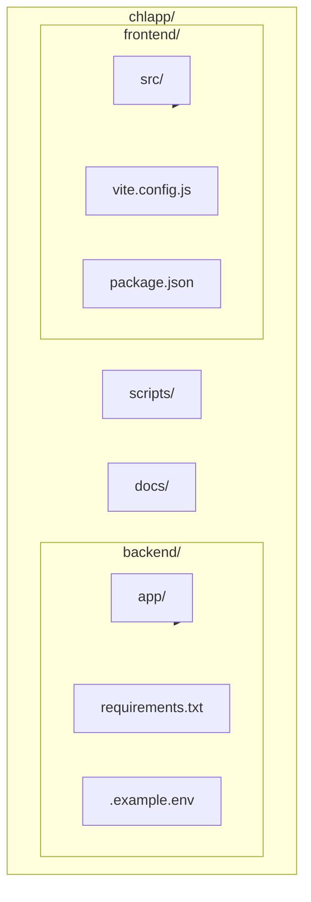
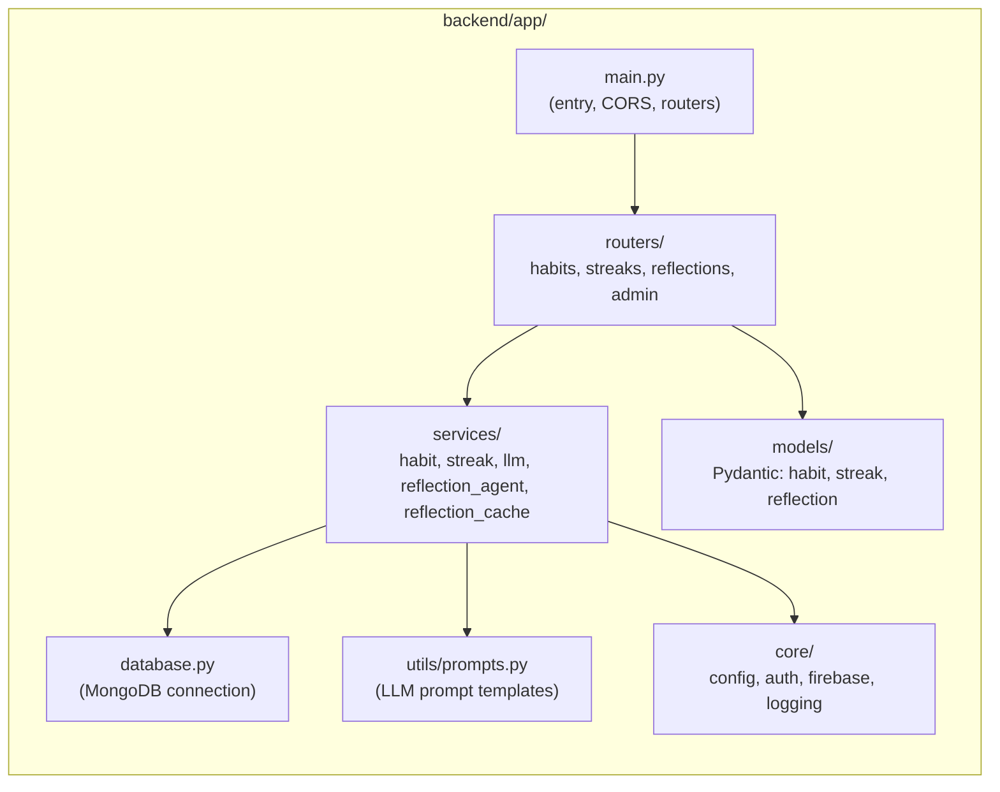
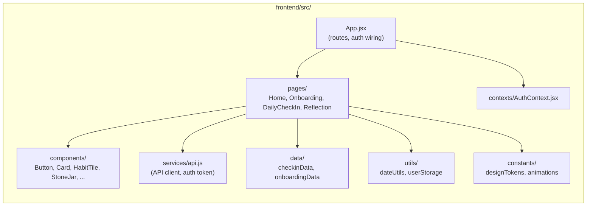
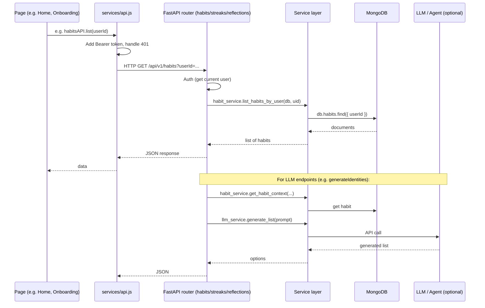
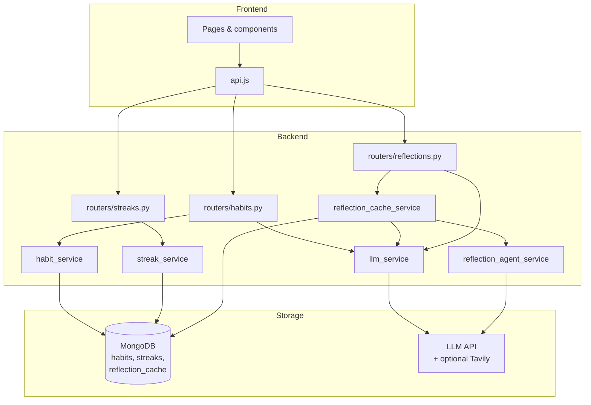

# Clear Habit Lab — Developer Onboarding

**Audience:** New developers joining the project  
**Purpose:** Understand repo structure, request flow, and where to find or change code.

---

## 1. Repo structure at a glance

- **backend:** FastAPI app (Python). Entry: `backend/app/main.py`.
- **frontend:** React + Vite app. Entry: `frontend/index.html` → `frontend/src/main.jsx`.
- **scripts:** `start-backend.sh`, `start-frontend.sh`, `start-all.sh`.
- **docs:** Product and developer diagrams (this file and `product-overview-diagram.md`).

---

## 2. Backend structure (where to look)

| Folder / file | Purpose |
|---------------|--------|
| **main.py** | FastAPI app, lifespan (DB connect/disconnect), CORS, mounts `habits`, `streaks`, `reflections`, and optionally `admin`. |
| **database.py** | MongoDB client, `connect_to_mongo()`, `get_database()`, index creation. |
| **core/** | `config` (env/settings), `auth` (Firebase JWT, current user, admin), `firebase` (init), `logging_config`. |
| **models/** | Pydantic request/response models: habits, streaks, reflections. Re-exported from `models/__init__.py`. |
| **routers/** | API route handlers. No business logic; call into **services**. |
| **services/** | Business logic: habits (CRUD, context), streaks (get/update by check-in), LLM (generate text/list/JSON), reflection agent (LangChain + Tavily), reflection cache (MongoDB cache, background generation). |
| **utils/prompts.py** | All LLM prompt builders (identity, short/full habit options, cues, preference edit options, reflection items, reflection agent system/user, reflection suggestion). |

---

## 3. Frontend structure (where to look)

| Path | Purpose |
|------|--------|
| **App.jsx** | Routes (`/`, `/home`, `/onboarding`, `/checkin`, `/reflect`), `setApiTokenGetter` / `setOnUnauthorized`, redirect after login. |
| **pages/** | **Home** (dashboard, habit tiles), **Onboarding** (multi-step habit setup), **DailyCheckIn** (check-in UI, stone jar, streak), **Reflection** (insights, questions, experiments). |
| **components/** | Reusable UI; exported from `components/index.js`. Includes route guards: `CheckInRouteGuard`, `ReflectionRouteGuard`. |
| **services/api.js** | Single API layer: `getApiBaseUrl()`, `apiRequest()`, token injection, 401 retry + `onUnauthorized`. All backend calls go through here (e.g. `habitsAPI`, `streaksAPI`, etc.). |
| **contexts/AuthContext.jsx** | Firebase auth state, `signInWithGoogle`, `signOut`, `getIdToken`, `isFirebaseConfigured`. |
| **data/** | Static options for check-in (obstacles, helpers, default user) and onboarding (identity, baseline, anchor, etc.). |
| **utils/** | `parseUtcDate` (dateUtils), `getOrCreateUserAndHabitIds`, `createNewHabitId`, `clearUserAndHabitIds` (userStorage). |

---

## 4. Request flow (what happens on an API call)

- **Frontend:** Page or component calls a function from `api.js` (e.g. `habitsAPI.list`, `habitsAPI.savePreference`, `reflectionsAPI.getReflectionItems`). No raw `fetch` to backend elsewhere.
- **Backend:** Router validates auth, loads any needed context from DB via a service, then calls service methods (DB and/or LLM). Routers do not touch the DB directly.

---

## 5. Data flow (conceptual)

- **Habits:** CRUD and “get context” go through `habit_service`; LLM endpoints use `utils/prompts.py` + `llm_service` (list or JSON).
- **Streaks:** Read/update via `streak_service`; updated on check-in from the frontend.
- **Reflections:** Either served from `reflection_cache_service` (MongoDB) or generated on demand via `reflection_agent_service` (LangChain + optional Tavily) or direct `llm_service.generate_json`. Background job after check-in can prefill cache.

---

## 6. Where to change what

| If you want to… | Look here |
|-----------------|-----------|
| Add or change an API endpoint | `backend/app/routers/` (habits, streaks, reflections, admin). |
| Change habit/streak/reflection business logic | `backend/app/services/`. |
| Change what we send to the LLM | `backend/app/utils/prompts.py`. |
| Change request/response shapes | `backend/app/models/` (habit, streak, reflection). |
| Change auth or env config | `backend/app/core/` (auth, config, firebase). |
| Add or change a screen | `frontend/src/pages/`. |
| Add or change reusable UI | `frontend/src/components/` and `components/index.js`. |
| Change how we call the backend | `frontend/src/services/api.js` (and add/use methods on `habitsAPI`, `streaksAPI`, etc.). |
| Change static options (e.g. obstacles, identity options) | `frontend/src/data/`. |
| Change design tokens or animations | `frontend/src/constants/`. |

---

## 7. Tech stack (quick reference)

| Layer | Tech |
|-------|------|
| Backend | Python 3.11+, FastAPI, Motor (async MongoDB), Pydantic |
| Auth | Firebase Auth (optional); JWT in backend `core/auth.py` |
| LLM | Configurable LLM API (see `core/config`); reflection can use LangChain + Tavily |
| Frontend | React 18, Vite, React Router |
| Hosting | Backend: e.g. Railway. Frontend: e.g. Vercel. See DEPLOYMENT.md / README. |

---

*Diagrams use [Mermaid](https://mermaid.js.org/). They render in GitHub, many IDEs, and [Mermaid Live](https://mermaid.live/).*
