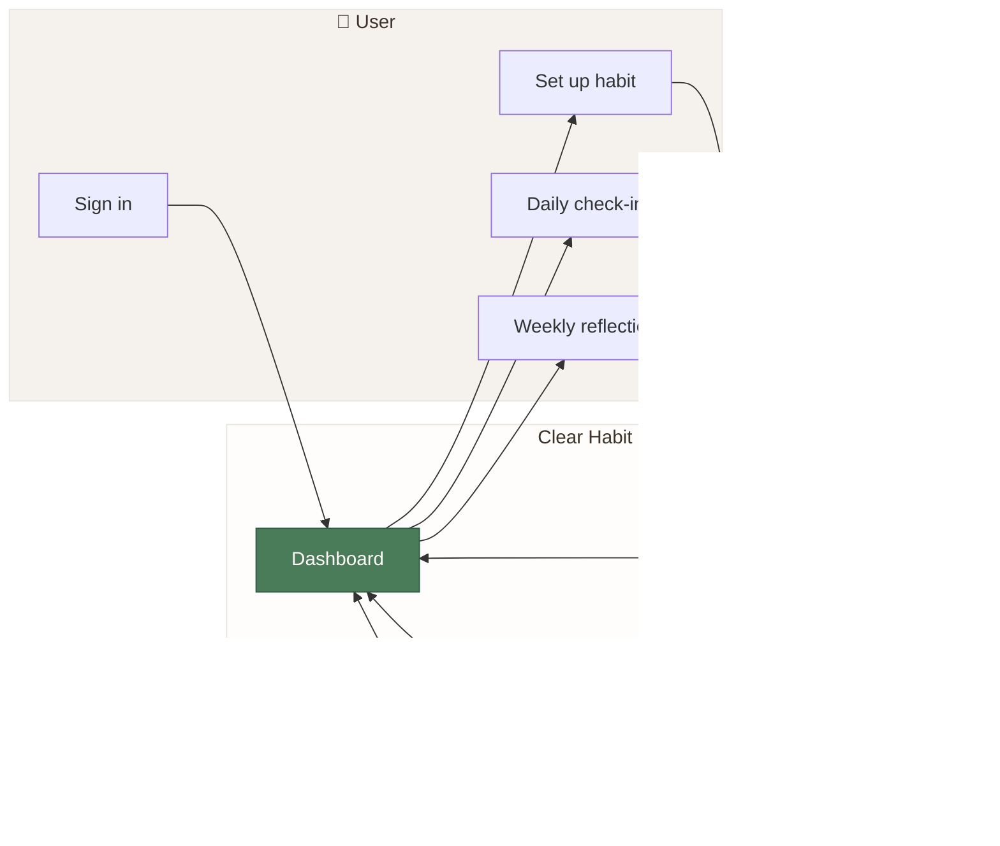
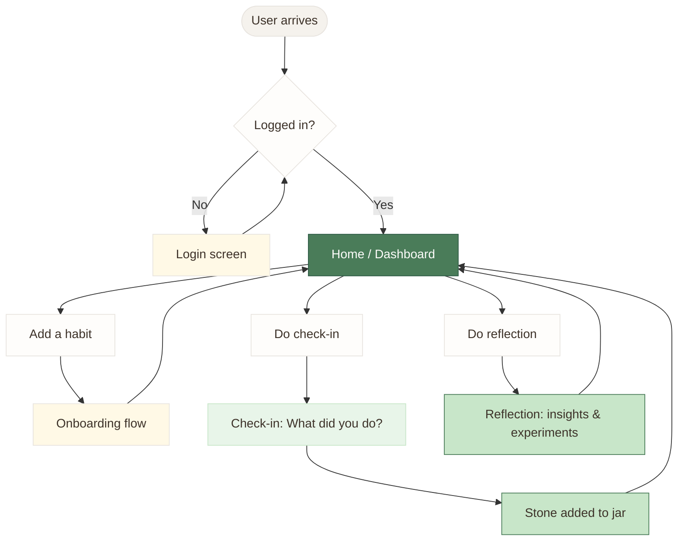
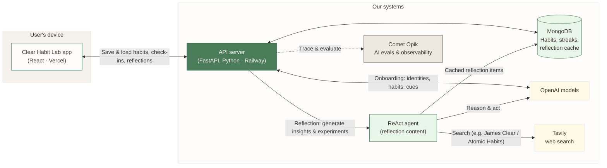
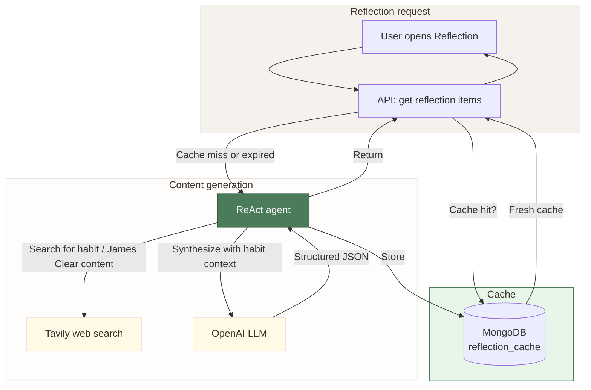

# Clear Habit Lab — Product & Business Overview

**Audience:** Product owners, business owners, stakeholders  
**Purpose:** Understand the product structure and user flows without technical detail.

*Visual style matches the app: warm cream background, forest green primary (#2D5A45, #4A7C59), soft success greens, and earthy accents.*

---

## 1. What the product does (high level)

```mermaid
flowchart LR
  subgraph User["👤 User"]
    A[Sign in]
    B[Set up habit]
    C[Daily check-in]
    D[Weekly reflection]
  end

  subgraph Product["Clear Habit Lab"]
    E[Dashboard]
    F[Onboarding]
    G[Check-in]
    H[Reflection]
  end

  A --> E
  E --> B
  B --> F
  F --> E
  E --> C
  C --> G
  G --> E
  E --> D
  D --> H
  H --> E

  style User fill:#F5F2ED,stroke:#E8E4DF,color:#3D3229
  style Product fill:#FEFDFB,stroke:#E8E4DF,color:#3D3229
  style E fill:#4A7C59,stroke:#2D5A45,color:#FEFDFB
  style F fill:#FFF9E6,stroke:#E8E4DF,color:#3D3229
  style G fill:#E8F5E9,stroke:#C8E6C9,color:#3D3229
  style H fill:#C8E6C9,stroke:#4A7C59,color:#3D3229
```

- **Dashboard (Home):** See all habits, streaks, stones, and quick access to check-in or reflect.
- **Onboarding:** New users define who they want to become (identity), nucleus habit, supernova habit, cue, enjoyment, and environment — with optional AI-generated options.
- **Check-in:** Log “I did it” (or not today), add a stone to the jar, keep streaks, and optionally note obstacles/helpers.
- **Reflection:** Weekly insights, reflection questions, and small experiment suggestions. Content is generated by a **ReAct agent** that can use **Tavily** web search (e.g. James Clear / Atomic Habits) plus the LLM to produce personalized, Atomic Habits–aligned content.

---

## 2. User journey (end-to-end flow)

```mermaid
flowchart TB
  Start([User arrives]) --> Login{Logged in?}
  Login -->|No| LoginScreen[Login screen]
  LoginScreen --> Login
  Login -->|Yes| Home[Home / Dashboard]

  Home --> AddHabit[Add a habit]
  AddHabit --> Onboarding[Onboarding flow]
  Onboarding --> Home

  Home --> CheckIn[Do check-in]
  CheckIn --> CheckInScreen[Check-in: What did you do?]
  CheckInScreen --> StoneAdded[Stone added to jar]
  StoneAdded --> Home

  Home --> Reflect[Do reflection]
  Reflect --> ReflectionScreen[Reflection: insights & experiments]
  ReflectionScreen --> Home

  style Start fill:#F5F2ED,stroke:#E8E4DF,color:#3D3229
  style Login fill:#FEFDFB,stroke:#E8E4DF,color:#3D3229
  style LoginScreen fill:#FFF9E6,stroke:#E8E4DF,color:#3D3229
  style Home fill:#4A7C59,stroke:#2D5A45,color:#FEFDFB
  style AddHabit fill:#FEFDFB,stroke:#E8E4DF,color:#3D3229
  style Onboarding fill:#FFF9E6,stroke:#E8E4DF,color:#3D3229
  style CheckIn fill:#FEFDFB,stroke:#E8E4DF,color:#3D3229
  style CheckInScreen fill:#E8F5E9,stroke:#C8E6C9,color:#3D3229
  style StoneAdded fill:#C8E6C9,stroke:#4A7C59,color:#3D3229
  style Reflect fill:#FEFDFB,stroke:#E8E4DF,color:#3D3229
  style ReflectionScreen fill:#C8E6C9,stroke:#4A7C59,color:#3D3229
```

- **First time:** Login → Home → “Add a habit” → Onboarding → back to Home.
- **Daily:** Home → “Check-in” → answer → stone added, streak updated → Home.
- **Weekly:** Home → “Reflect” → read insights, answer questions, see experiments → Home.

---

## 3. Where data lives (conceptual)

```mermaid
flowchart LR
  subgraph UserDevice["User's device"]
    App["Clear Habit Lab app<br/>(React · Vercel)"]
  end

  subgraph OurSystems["Our systems"]
    API["API server<br/>(FastAPI, Python · Railway)"]
    DB[(MongoDB<br/>Habits, streaks,<br/>reflection cache)]
    AI[OpenAI models]
    ReAct["ReAct agent<br/>(reflection content)"]
    Tavily["Tavily<br/>web search"]
    Opik["Comet Opik<br/>AI evals & observability"]
  end

  App <-->|"Save & load habits, check-ins, reflections"| API
  API <--> DB
  API <-->|"Onboarding: identities, habits, cues"| AI
  API -->|"Reflection: generate insights & experiments"| ReAct
  ReAct -->|"Reason & act"| AI
  ReAct -->|"Search (e.g. James Clear / Atomic Habits)"| Tavily
  ReAct -->|"Cached reflection items"| DB
  API -.->|"Trace & evaluate"| Opik

  style UserDevice fill:#F5F2ED,stroke:#E8E4DF,color:#3D3229
  style OurSystems fill:#FEFDFB,stroke:#E8E4DF,color:#3D3229
  style App fill:#FEFDFB,stroke:#4A7C59,color:#3D3229
  style API fill:#4A7C59,stroke:#2D5A45,color:#FEFDFB
  style DB fill:#E8F5E9,stroke:#4A7C59,color:#3D3229
  style AI fill:#FFF9E6,stroke:#E8E4DF,color:#3D3229
  style ReAct fill:#E8F5E9,stroke:#4A7C59,color:#3D3229
  style Tavily fill:#FFF9E6,stroke:#E8E4DF,color:#3D3229
  style Opik fill:#EDE8E0,stroke:#6B5D4D,color:#3D3229
```

- **App (React / Vercel):** Frontend — what the user sees and taps (dashboard, onboarding, check-in, reflection). Built with React; deployed on Vercel.
- **API (FastAPI, Python / Railway):** Backend — receives and sends habits, check-ins, streaks, and reflection requests. Built with FastAPI (Python); deployed as a Railway project.
- **MongoDB:** Database — stores habits, preferences, check-in history, streaks, and cached reflection items.
- **OpenAI models:** Used to generate identity/habit/cue options in onboarding. Also used by the ReAct agent when generating reflection content.
- **ReAct agent:** Generates reflection content (insights, questions, experiment suggestions). Uses reasoning and tool use: it can call Tavily to search for James Clear / Atomic Habits content, then synthesize that with the user’s habit context into personalized reflection items. Results are cached so the Reflection screen loads quickly.
- **Tavily:** Web search tool used by the ReAct agent to pull in up-to-date or authoritative content (e.g. Atomic Habits) when building reflection insights and experiments.
- **Comet Opik:** AI evals and observability — we use Opik to trace and evaluate the AI parts of the application (LLM calls, reflection agent).

### 3.1 How reflection content is generated

Reflection insights, questions, and experiment suggestions are produced by a **ReAct agent** that can use **Tavily** to search the web (e.g. for James Clear / Atomic Habits content), then uses the LLM to turn that plus the user’s habit context into structured content.

```mermaid
flowchart TB
  subgraph Request["Reflection request"]
    User[User opens Reflection]
    API[API: get reflection items]
  end

  subgraph CacheCheck["Cache"]
    DB[(MongoDB<br/>reflection_cache)]
  end

  subgraph Generation["Content generation"]
    Agent[ReAct agent]
    Tavily[Tavily web search]
    LLM[OpenAI LLM]
    Agent -->|"Search for habit / James Clear content"| Tavily
    Agent -->|"Synthesize with habit context"| LLM
    LLM -->|"Structured JSON"| Agent
  end

  User --> API
  API -->|"Cache hit?"| DB
  DB -->|"Fresh cache"| API
  API -->|"Cache miss or expired"| Agent
  Agent -->|"Store"| DB
  Agent -->|"Return"| API
  API --> User

  style Request fill:#F5F2ED,stroke:#E8E4DF,color:#3D3229
  style CacheCheck fill:#E8F5E9,stroke:#4A7C59,color:#3D3229
  style Generation fill:#FEFDFB,stroke:#E8E4DF,color:#3D3229
  style Agent fill:#4A7C59,stroke:#2D5A45,color:#FEFDFB
  style Tavily fill:#FFF9E6,stroke:#E8E4DF,color:#3D3229
  style LLM fill:#FFF9E6,stroke:#E8E4DF,color:#3D3229
```

- **ReAct agent:** Reasons over the user’s habit and streak data, optionally calls **Tavily** to fetch relevant material, then calls the **LLM** to produce insights, reflection questions, and three experiment suggestions (anchor, environment, enjoyment). Output is cached in MongoDB for fast loads.

---

## 4. Main product flows (what happens when)

| Flow | Trigger | What happens |
|------|--------|---------------|
| **Onboarding** | User adds a new habit | User picks or edits identity, nucleus habit, supernova habit, cue, enjoyment, environment. AI can suggest options at each step. Plan is saved. |
| **Check-in** | User taps “Check in” on a habit | User chooses what they did (nucleus, supernova, other, or “not today”). One stone added when they did something. Streak and totals update. Optionally they note obstacles/helpers. |
| **Reflection** | User opens Reflection for a habit | App loads cached or fresh content. When fresh, a **ReAct agent** runs: it may use **Tavily** to search for James Clear / Atomic Habits content, then the LLM produces insights, reflection questions, and 3 experiment suggestions (anchor, environment, enjoyment). Results are cached. User can answer questions and apply suggestions to their plan. |
| **Background prep** | After a check-in | System may pre-generate reflection content for that habit (via the ReAct agent and Tavily when configured) so the Reflection screen loads quickly next time. |

---

## 5. Key product concepts

- **Identity:** “I am someone who…” — the identity statement the user is building with this habit.
- **Nucleus habit:** Smallest “show up” version (e.g. 2 minutes).
- **Supernova habit:** Full version when they have more energy.
- **Cue / anchor:** When or after what the habit happens (e.g. “after morning coffee”).
- **Stones & jar:** One stone per successful check-in; visual progress.
- **Streak:** Consecutive days with at least one check-in.
- **Reflection:** Weekly insights and experiment suggestions, grounded in Atomic Habits–style ideas.

---

## Color reference (matches the app)

| Use in diagram | Hex | App token |
|----------------|-----|-----------|
| Warm background | `#F5F2ED` | background |
| Card / surface | `#FEFDFB` | card |
| Primary green | `#4A7C59` | primaryLight |
| Dark green | `#2D5A45` | primary |
| Success light | `#E8F5E9` | successLight |
| Success medium | `#C8E6C9` | successMedium / baseline |
| Accent / onboarding | `#FFF9E6` | accent |
| Border | `#E8E4DF` | border |
| Text | `#3D3229` | text |

---

*Diagrams use [Mermaid](https://mermaid.js.org/). They render in GitHub, many IDEs, and [Mermaid Live](https://mermaid.live/).*
