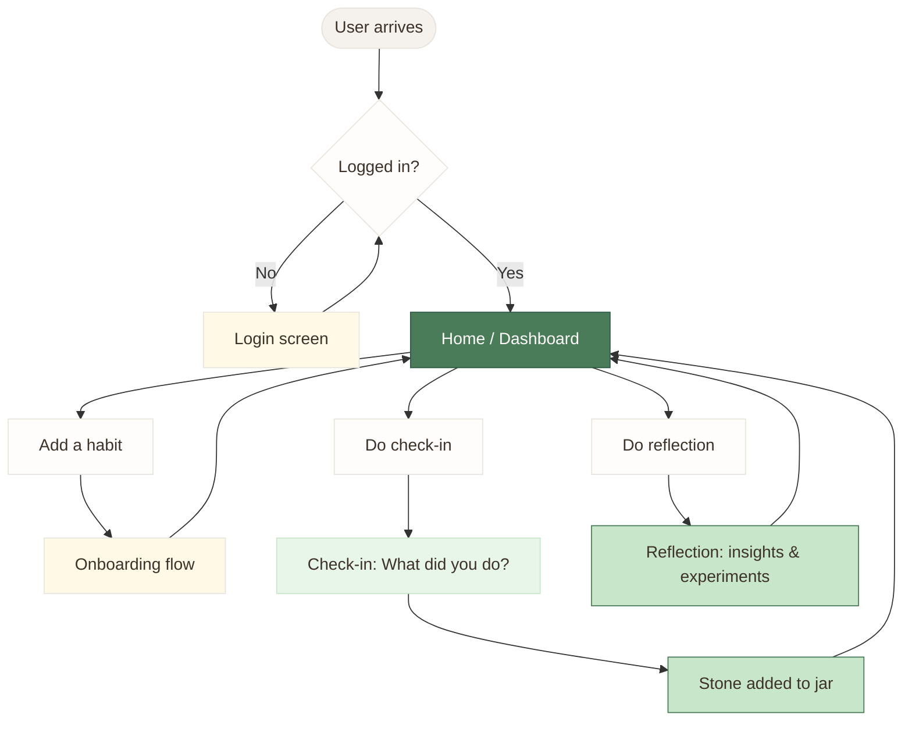
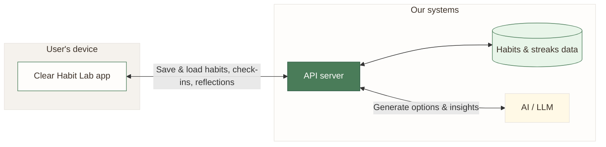

# Clear Habit Lab — Product & Business Overview

**Audience:** Product owners, business owners, stakeholders  
**Purpose:** Understand the product structure and user flows without technical detail.

*Visual style matches the app: warm cream background, forest green primary (#2D5A45, #4A7C59), soft success greens, and earthy accents.*

---

## 1. What the product does (high level)

```mermaid
flowchart LR
  subgraph User["👤 User"]
    A[Sign in]
    B[Set up habit]
    C[Daily check-in]
    D[Weekly reflection]
  end

  subgraph Product["Clear Habit Lab"]
    E[Dashboard]
    F[Onboarding]
    G[Check-in]
    H[Reflection]
  end

  A --> E
  E --> B
  B --> F
  F --> E
  E --> C
  C --> G
  G --> E
  E --> D
  D --> H
  H --> E

  style User fill:#F5F2ED,stroke:#E8E4DF,color:#3D3229
  style Product fill:#FEFDFB,stroke:#E8E4DF,color:#3D3229
  style E fill:#4A7C59,stroke:#2D5A45,color:#FEFDFB
  style F fill:#FFF9E6,stroke:#E8E4DF,color:#3D3229
  style G fill:#E8F5E9,stroke:#C8E6C9,color:#3D3229
  style H fill:#C8E6C9,stroke:#4A7C59,color:#3D3229
```

- **Dashboard (Home):** See all habits, streaks, stones, and quick access to check-in or reflect.
- **Onboarding:** New users define who they want to become (identity), nucleus habit, supernova habit, cue, enjoyment, and environment — with optional AI-generated options.
- **Check-in:** Log “I did it” (or not today), add a stone to the jar, keep streaks, and optionally note obstacles/helpers.
- **Reflection:** Weekly AI-generated insights, reflection questions, and small experiment suggestions (aligned with Atomic Habits).

---

## 2. User journey (end-to-end flow)

- **First time:** Login → Home → “Add a habit” → Onboarding → back to Home.
- **Daily:** Home → “Check-in” → answer → stone added, streak updated → Home.
- **Weekly:** Home → “Reflect” → read insights, answer questions, see experiments → Home.

---

## 3. Where data lives (conceptual)

- **App:** What the user sees and taps (dashboard, onboarding, check-in, reflection).
- **API:** Receives and sends habits, check-ins, streaks, and reflection requests.
- **Database:** Stores habits, preferences, check-in history, and streaks.
- **AI:** Used to generate identity/habit/cue options in onboarding, and insights + experiments in reflection (optionally with web search for Atomic Habits content).

---

## 4. Main product flows (what happens when)

| Flow | Trigger | What happens |
|------|--------|---------------|
| **Onboarding** | User adds a new habit | User picks or edits identity, nucleus habit, supernova habit, cue, enjoyment, environment. AI can suggest options at each step. Plan is saved. |
| **Check-in** | User taps “Check in” on a habit | User chooses what they did (nucleus, supernova, other, or “not today”). One stone added when they did something. Streak and totals update. Optionally they note obstacles/helpers. |
| **Reflection** | User opens Reflection for a habit | App loads cached or fresh AI-generated insights, reflection questions, and 3 experiment suggestions (anchor, environment, enjoyment). User can answer questions and apply suggestions to their plan. |
| **Background prep** | After a check-in | System may pre-generate reflection content for that habit so the Reflection screen loads quickly next time. |

---

## 5. Key product concepts

- **Identity:** “I am someone who…” — the identity statement the user is building with this habit.
- **Nucleus habit:** Smallest “show up” version (e.g. 2 minutes).
- **Supernova habit:** Full version when they have more energy.
- **Cue / anchor:** When or after what the habit happens (e.g. “after morning coffee”).
- **Stones & jar:** One stone per successful check-in; visual progress.
- **Streak:** Consecutive days with at least one check-in.
- **Reflection:** Weekly insights and experiment suggestions, grounded in Atomic Habits–style ideas.

---

## Color reference (matches the app)

| Use in diagram | Hex | App token |
|----------------|-----|-----------|
| Warm background | `#F5F2ED` | background |
| Card / surface | `#FEFDFB` | card |
| Primary green | `#4A7C59` | primaryLight |
| Dark green | `#2D5A45` | primary |
| Success light | `#E8F5E9` | successLight |
| Success medium | `#C8E6C9` | successMedium / baseline |
| Accent / onboarding | `#FFF9E6` | accent |
| Border | `#E8E4DF` | border |
| Text | `#3D3229` | text |

---

*Diagrams use [Mermaid](https://mermaid.js.org/). They render in GitHub, many IDEs, and [Mermaid Live](https://mermaid.live/).*
